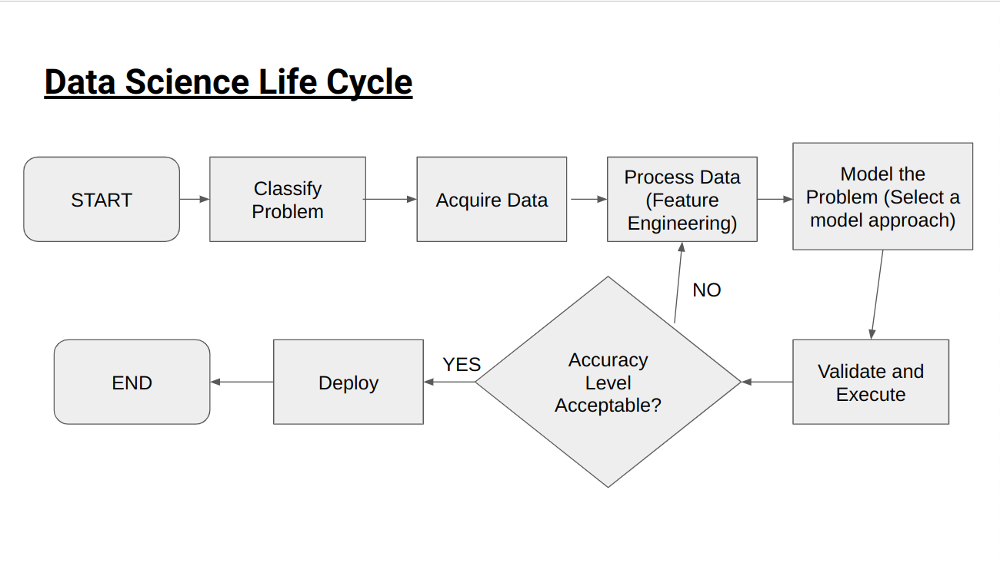
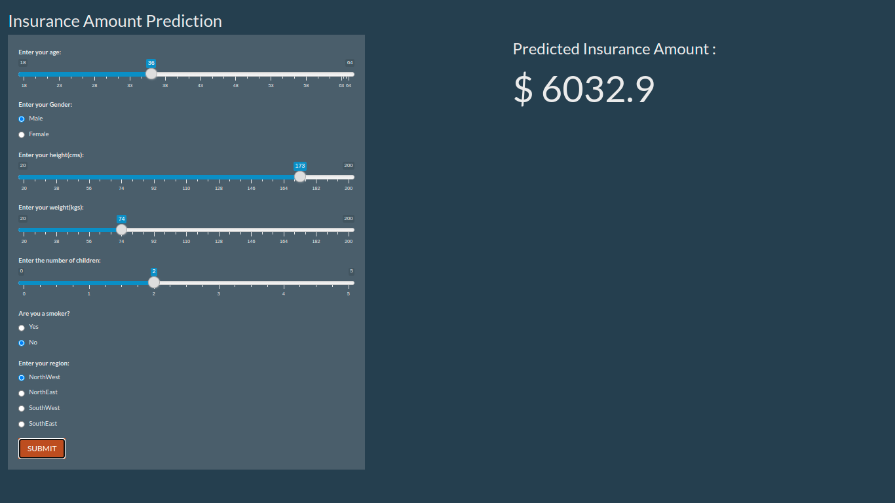

### Data Scince Life Cycle

### High Level Problem Statement!

To predict the insurance expenses of a person in the US depending on basic information such as gender, age, bmi etc.

### Dataset Details
1. Number of Records / Observations: 1338
2. Number of Features: 7

### Data Features Available
Numerical Features :  `age` , `bmi` , `children` ,`expenses`
Categorical Features : `sex`, `smoker` ,`region` 

### Model UI Prediction Sample

